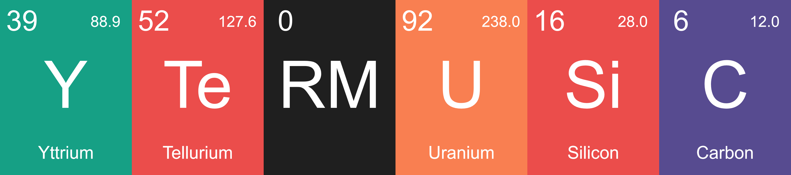
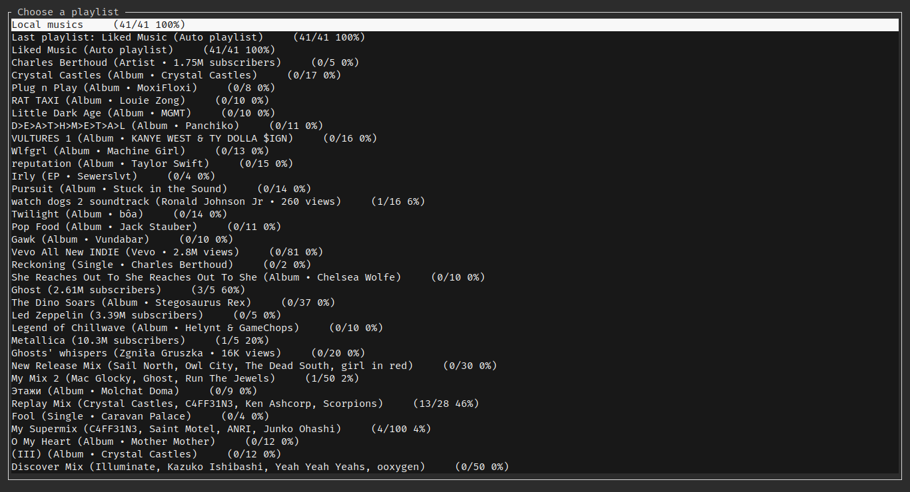

# YTerMusic



YTerMusic is a TUI based Youtube Music Player that aims to be as fast and simple as possible.

## Screenshots
<p>
  
  
</p>


## Features and upcoming features

- Play your Youtube Music Playlist and Supermix.
- Memory efficient (Around 20MB of RAM while fully loaded)
- Cache all downloads and store them
- Work even without connection (If musics were already downloaded)
- Automatic background download manager
	### Check List 
	- [x] Playlist selector
	- [x] Error message display in the TUI
	- [x] Enable connection less music playing
	- [ ] Cache limit to not exceed some given disk space
	- [x] A download limit to stop downloading after the queue is full
	- [x] Mouse support
	- [x] Search
	- [x] Custom theming (You can use hex! #05313d =  )

## Install
> [!TIP]
> 3rd party AUR packages are available [here](https://aur.archlinux.org/packages?O=0&K=ytermusic).

- Download the latest version from [releases](https://github.com/ccgauche/ytermusic/releases/latest).
	### Linux
	Install the following libraries: 
	```sh
	sudo apt install alsa-tools libasound2-dev libdbus-1-dev pkg-config
	```
- Use `cargo` to install the latest version
	```sh
	cargo install ytermusic --git https://github.com/ccgauche/ytermusic
	```
## Setup
> [!IMPORTANT] 
> If you're using Firefox enable the "Raw" switch so the cookie isn't mangled.
> 

- Give `ytermusic` authentication to your account, by copying out the headers
	1. Open the https://music.youtube.com website in your browser
	2. Open the developer tools (<kbd>F12</kbd> or <kbd>Fn</kbd> + <kbd>F12</kbd>)
	3. Go to the Network tab
	4. Find the request to the `music.youtube.com` document `/` page
	5. Copy the `Cookie` header from the associated response request
	6. Create a `headers.txt` file in one of the checked [paths](https://docs.rs/directories/latest/directories/struct.ProjectDirs.html#method.config_dir).
	7. Create an entry like this :
	```
	Cookie: <cookie>
	User-Agent: Mozilla/5.0 (X11; Linux x86_64) AppleWebKit/537.36 (KHTML, like Gecko) Chrome/110.0.0.0 Safari/537.36
	```
- Then you can start `ytermusic`

### (Optional) Using a brand account
- If you use a second account for youtube music
  	1. Go to https://myaccount.google.com/
  	2. Switch to your brand account
  	3. copy the number written in the url, after \b\
  	4. paste it into a new `account_id.txt` file in the same folder as `headers.txt`

## Building from source

- Clone the repository
- Install rust `https://rustup.rs` nightly
- Run `cargo build --release`
- The executable is in `target/release/ytermusic.exe` or `target/release/ytermusic`

## Usage

- Use your mouse to <kbd>click</kbd> in lists if your terminal has mouse support
- Press <kbd>Space</kbd> to play/pause
- Press <kbd>Enter</kbd> to select a playlist or a music
- Press <kbd>f</kbd> to search
- Press <kbd>s</kbd> to shuffle
- Press <kbd>Arrow Right</kbd> or <kbd>\></kbd> to skip 5 seconds
- Press <kbd>Arrow Left</kbd> or <kbd>\<</kbd> to go back 5 seconds
- Press <kbd>CTRL</kbd> + <kbd>Arrow Right</kbd> or <kbd>CTRL</kbd> + <kbd>\></kbd> to go to the next song
- Press <kbd>CTRL</kbd> + <kbd>Arrow Left</kbd> or <kbd>CTRL</kbd> + <kbd>\<</kbd> to go to the previous song
- Press <kbd>+</kbd> for volume up
- Press <kbd>-</kbd> for volume down
- Press <kbd>Arrow down</kbd> to scroll down
- Press <kbd>Arrow up</kbd> to scroll up
- Press <kbd>ESC</kbd> to exit the current menu
- Press <kbd>CTRL</kbd> + <kbd>C</kbd> or <kbd>CTRL</kbd> + <kbd>D</kbd> to exit

## How to fix common issues

If you have any issues start by running:
```sh
ytermusic --fix-db
```
This will try to fix any issues with the cache database.

If you still have issues, you can clear the cache by running:
```sh
ytermusic --clear-cache
```

If you need to report an issue or find the files related to ytermusic:
```sh
ytermusic --files
```

## Changelog

```
Beta b0.1.1
 - Added `hide_channels_on_homepage` with a default value of `true` to the config file
 - Added `hide_albums_on_homepage` with a default value of `false` to the config file
 - Fixed default style to support transparency
 - Added more color configuration options

Beta b0.1.0
 - Fixed keyboard handling on windows
 - Improved error handling
 - Fixed youtube downloads
 - Made volume bar optional in config
 - Improved performance and updated dependencies

Alpha a0.0.11

- Added scrollable music view
- Added shuffle functionality
- Fixed some crashes while resizing the app
- Added error messages for invalid headers or cookies
- Added error messages for expired cookies

Alpha a0.0.10

- Speed up the download process
- Fix the download limit
- Fix music artists getting smashed together
- Fix the download manager not downloading all musics
- Improved stability
- Improved logs and added timings to better debug

Alpha a0.0.9:

- Progress info for downloads
- Mouse support on time bar
- Vertical volume bar
- Vertical volume bar supports mouse click
- Scroll to change volume and skip in timeline
- Improved the scrolling action
- Fixed the bug where the time bar would not update
- Debouncing the search input
- Changed the location of the cache folder to follow the XDG Base Directory Specification (By @FerrahWolfeh #20)
- More configuration options (By @ccgauche and @FerrahWolfeh)

Alpha a0.0.8

- Fixed scrolling
- Fixed audio-glitches
- Removed nightly flag use

Alpha a0.0.7

- Major changes in the API
- Fixed log file bloat issue

Alpha a0.0.6

- Fix: Fix a bug where the app would crash when trying to play a song that was not downloaded
- Fix: Improve the logger to not print the same error twice
- Improved startup time
- Fixed linux build
- Changed how task are distributed to the thread pool

Alpha a0.0.5

- Added local database cache to improve IO accesses
- Added searching for musics in the local library
- Greatly improved render performance and RAM usage
- Error management and error display in specific screen

Alpha a0.0.4

- Added menu navigation
- Added searching for musics
- Added new terminal backend

Alpha a0.0.3

- Mouse support to select playlist and music
- Download limiter
- Connection less music playing

Alpha a0.0.2

- Playlist selector
- Improved error management
- Improved TUI
- Performance upgrade
- Switch to Rustls instead of openSSL
```
